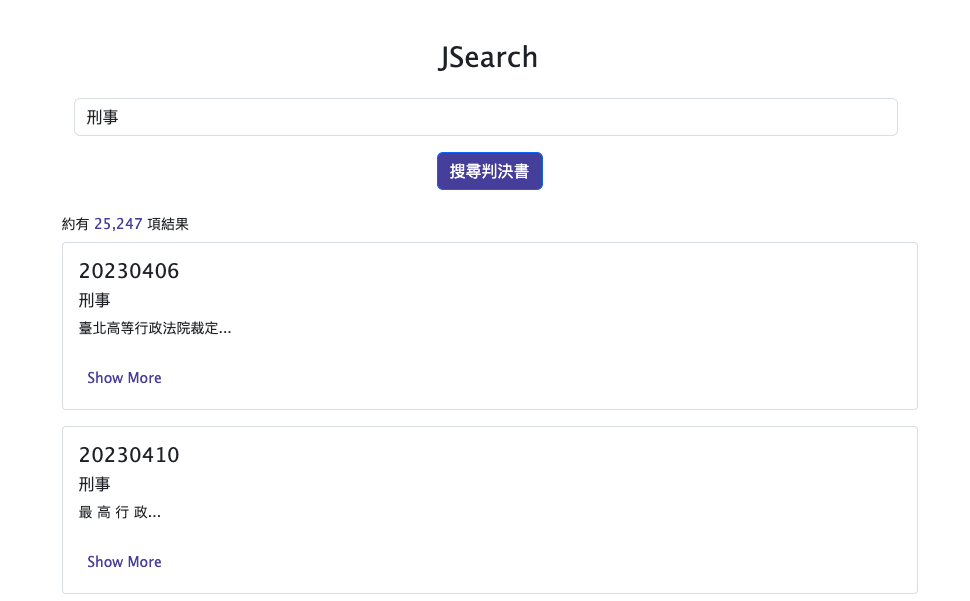

# JSearch

[JSearch](https://jsearch.aaronpan.site) is a service that can search judgments in Taiwan. It's just a simple project for demo. The data source for judgments is from [司法院資料開放平臺](https://opendata.judicial.gov.tw/).



## Tech Stack
- [Node.js](https://nodejs.org/)
- [express](https://www.npmjs.com/package/express)
- [express-generator](https://www.npmjs.com/package/express-generator)
- [MongoDB](https://www.mongodb.com/)

## Getting Start


1. Clone the repo
```shell
git clone https://github.com/aapan/JSearch.git

cd JSearch
```

2. Set the necessary environment variables
```shell
cp .env.example .env

vim .env
```

3. Build and start MongoDB
```
docker-compose up -d 

# Need to create a DB and user for the first time. 
# Reference: https://www.mongodb.com/docs/manual/tutorial/create-users/
```

4. Install dependencies
```shell
npm install
```

5. Start the development server
```shell
npm start
# or
nodemon start
```

## Contact

Email: aaron09720@gmail.com


